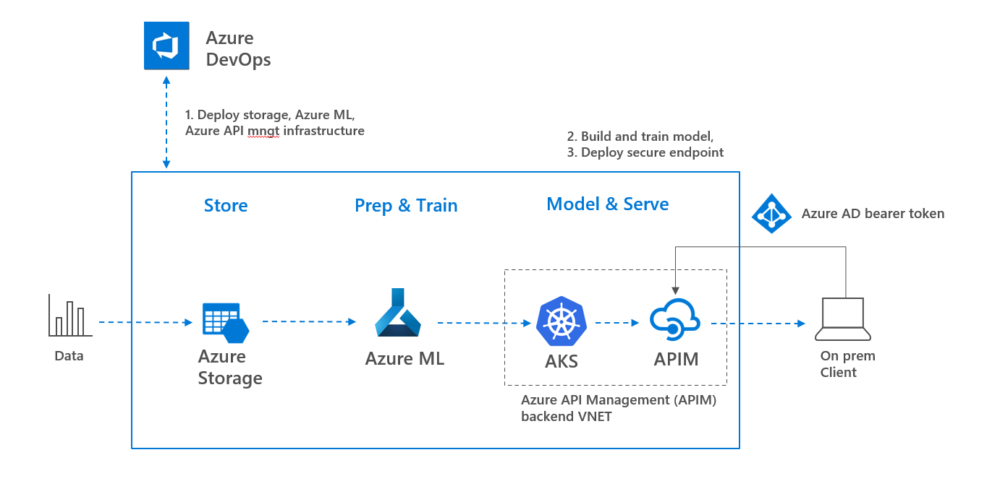

# mlops, secure endpoints

This repo shows some introduction examples to Azure Machine Learning and a simple MLOps implemenation in which endpoints are secured by Azure API Management. Elaborating on this [git repo](https://github.com/csiebler/mlops-demo) of Clemens Siebler.

## Setup & Demo Flow

This gives a short, high-level overview of how this repo may be used.



## Simple MLOps pipelines

1. Create a new project in Azure DevOps
1. Fork this repo or import it into Azure DevOps (so that you can make changes to the repo)
1. Create a service connection to your Azure Machine Learning workspace and use the name `aml-workspace-connection`
1. Edit [`pipelines/german-credit-config.yml`](pipelines/german-credit-config.yml) and adapt the values to point to your workspace
1. Import the following pipelines into DevOps
    * [`pipelines/1-german-credit-infrastructure.yml`](pipelines/1-german-credit-infrastructure.yml) - Deploys Azure ML workspace with a dataset and private AKS cluster in VNET and Azure Api management
    * [`pipelines/2-german-credit-train-and-register.yml`](pipelines/2-german-credit-train-and-register.yml) - Trains and registers the model automatically
    * [`pipelines/3a-german-credit-deploy.yml`](pipelines/3a-german-credit-deploy.yml) - Deploys the trained model to AKS cluster creating a private endpoint
    * [`pipelines/3b-german-credit-apimoperation.yml`](pipelines/3b-german-credit-apimoperation.yml) - Deploys an APIM endpoint exposing the private AKS endpoint. Authentication is based on Azure AD

## Conventions

This repo is fully based on conventions in order to make MLOps reusable and easily scaleable.
The directory structure is as follows:

```
pipelines
    \- german-credit-config.yml - Configuration for german credit model
    \- german-credit-deploy.yml - Deployment pipeline for german credit model
    \- german-credit-train-and-register.yml - Pipline for training and registering the base german credit model
models
    \- model1
        train.py (entry file for training)
        score.py (entry file for scoring)
        \- config
            deployment-config-aks.yml - Deployment infrastructure definition (e.g., AKS configuration)
            inference-conda.yml - Conda environement definition for inferencing/scoring
            inference-config.yml - Azure Machine Learning config for inferencing
            train-conda.yml - Conda environement definition for training
    \- model2
        ...same file and folder structure...
```

## Testing

This snipped can be used to manually showcase/test the deployed model on AKS using the APIM exposed endpoint: 

```python
import requests
import json

import json
import requests
#
# creating bearer token using SPN (can also be created using Managed Identity or logging in as a user)
tenant ='<<your tenant id>>'
client_id = '<<spn client id>>'
client_secret = '<<spn secret>>'

url = 'https://login.microsoftonline.com/%s/oauth2/token' % tenant
data = {
  'grant_type': 'client_credentials',
  'client_id': client_id,
  'client_secret': client_secret
}

headers = {'Content-Type': 'application/x-www-form-urlencoded'}
resp = requests.post(url, data=data, headers=headers)

token = resp.json()['access_token']
print(str(token))
#
url = 'https://<<your apim>.azure-api.net/testprivv2/score'
#
test_data = {
  'data': [{
    "Age": 20,
    "Sex": "male",
    "Job": 0,
    "Housing": "own",
    "Saving accounts": "little",
    "Checking account": "little",
    "Credit amount": 100,
    "Duration": 48,
    "Purpose": "radio/TV"
  }]
}

headers = {'Content-Type':'application/json', 'Authorization': 'bearer ' + token}
resp = requests.post(url, json=test_data, headers=headers)

print("Prediction (good, bad):", resp.text)
```

## Further Work

:star: A fully documented starting template for Azure Machine Leraning with MLOps can be found here: [microsoft/aml-acceleration-template](https://github.com/microsoft/aml-acceleration-template/). This includes model training, validation, testing, deployment, pipelines, and several other production-grade capabilties.